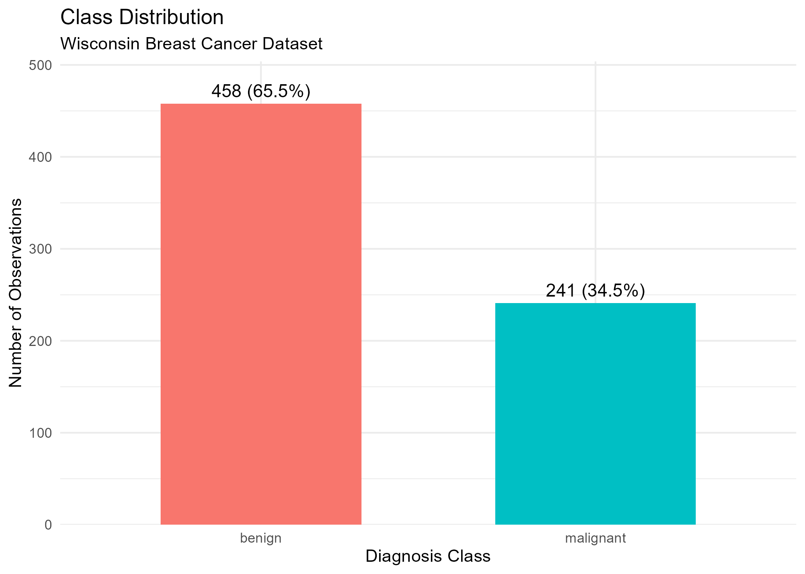

# Predictive Modelling of Breast Cancer Diagnosis

## Overview
This project applies machine learning methods to classify breast tumours as benign or malignant using the Wisconsin Breast Cancer dataset from the UCI Machine Learning Repository.

Three classification models were implemented and compared:
- Logistic Regression
- Support Vector Machine (SVM)
- Random Forest

Performance was evaluated using:
- Accuracy
- Sensitivity
- Specificity
- Precision
- F1-score
- ROC/AUC

The analysis prioritised minimising false negatives due to the clinical risk associated with missed malignant diagnoses.

## Key Findings
- Random forest achieved the strongest overall performance (Accuracy = 97.1%, AUC = 0.995)
- SVM achieved the highest sensitivity (98.6%), reducing false negatives
- Logistic regression produced competitive results despite its simpler linear structure
- Strong class separability suggests the dataset is highly structured

## Repository Structure
├── outputs/
│   ├── figures/
│   ├── auc_results.csv
│   ├── cross_validation_accuracy.csv
│   └── model_metrics.csv
├── breast_cancer_modelling.R
├── breast_cancer_modelling_report.pdf
└── README.md

## Dataset
The Wisconsin Breast Cancer dataset contains 699 observations and 9 predictor variables describing cellular characteristics derived from digitised fine needle aspirate images.

Predictors include:
- Clump thickness
- Cell size
- Cell shape
- Bare nuclei
- Bland chromatin

The outcome variable represents tumour classification:
- Benign
- Malignant

Missing values were present in the `Bare.nuclei` variable (n = 16) and were imputed using the median.

Dataset source:
https://archive.ics.uci.edu/dataset/15/breast+cancer+wisconsin+original

## Dataset Characteristics
The dataset contains a moderate class imbalance:
- Benign: 458 observations (65.5%)
- Malignant: 241 observations (34.5%)

Understanding class distribution is important in diagnostic classification problems because model accuracy alone can become misleading when one class dominates the dataset.

The class distribution is shown below:

## Pre-processing
Pre-processing steps included:
- Removal of the non-predictive ID variable
- Median imputation for missing values
- Stratified 70:30 train-test split
- Feature standardisation for SVM models
- Correlation analysis of predictors

Scaling parameters were estimated using training data only and then applied to the test set to prevent data leakage.

## Machine Learning Methods
### Logistic Regression
Used as an interpretable baseline linear classifier.

### Support Vector Machine
A radial kernel SVM was implemented to model non-linear decision boundaries.

### Random Forest
Random Forest was used as an ensemble learning approach and to assess variable importance.

## Results
Random Forest achieved the strongest overall performance:

| Model | Accuracy | Sensitivity | Specificity | AUC |
|---|---|---|---|---|
| Logistic Regression | 0.957 | 0.944 | 0.964 | 0.992 |
| Support Vector Machine | 0.943 | 0.986 | 0.920 | 0.988 |
| Random Forest | 0.971 | 0.972 | 0.971 | 0.995 |

The SVM model achieved the highest sensitivity, improving detection of malignant cases.

Random Forest achieved the strongest balance between sensitivity and specificity.

## Reproducibility
To reproduce the analysis:

1. Install required R packages
2. Run `breast_cancer_modelling.R`
3. Outputs will be generated automatically in the `outputs/` directory

The workflow uses a fixed random seed (`set.seed(123)`) for reproducibility.

## Interpretation
The results suggest that model selection is less dependent on marginal differences in accuracy and more dependent on the clinical consequences of misclassification.

False negatives represent missed malignant diagnoses and therefore carry substantially greater risk than false positives. This makes sensitivity particularly important in diagnostic classification problems.

Several predictors showed strong positive correlations, particularly variables describing related cellular morphology characteristics.

Random Forest variable importance analysis identified:
- Bare nuclei
- Clump thickness
- Cell size
as the strongest predictors within the model.
